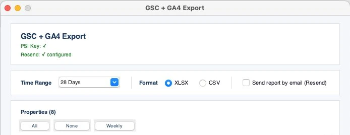
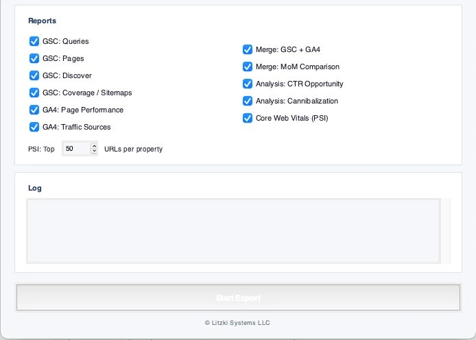

# GSC + GA4 Export


A local Python tool that pulls data from Google Search Console and Google Analytics 4, merges both sources, and exports structured XLSX reports — no SaaS dependency, no data leaving your machine.



---

## Why I built this

Every reporting workflow I tried required either a paid SaaS subscription, a Google Sheets plugin that breaks on API updates, or a Python script that only does one thing. None of them merged GSC and GA4 data at the URL level, calculated month-over-month deltas, and flagged cannibalization in the same export.

This tool does all of that locally, in one run, with a clean XLSX output you can hand to a client or drop into a dashboard.

---

## What it does

- Fetches GSC queries, pages, Discover, and sitemap coverage
- Fetches GA4 page performance and traffic sources
- Merges GSC + GA4 data by URL into a single sheet
- Calculates month-over-month deltas for clicks, impressions, and position
- Identifies CTR opportunities: high impressions, low CTR, strong position
- Detects keyword cannibalization across pages
- Runs PageSpeed Insights for Core Web Vitals on top URLs
- Exports everything as a single XLSX with one tab per analysis



---

## Reports

| Sheet | Description |
|---|---|
| 00 Summary | Overview of all sheets with click and impression totals |
| GSC Queries | All queries sorted by impressions |
| GSC Pages | All pages sorted by impressions |
| GSC Discover | Discover performance (if available) |
| GSC Coverage / Sitemaps | Sitemap submission and indexing status |
| GA4 Page Performance | Sessions, pageviews, bounce rate, engagement rate |
| GA4 Traffic Sources | Channel breakdown |
| Merge: GSC + GA4 | URL-level join of GSC and GA4 data |
| Merge: MoM Comparison | Month-over-month delta for all pages |
| Analysis: CTR Opportunity | Pages with high impressions and low CTR |
| Analysis: Cannibalization | Queries competing across multiple pages |
| Core Web Vitals (PSI) | LCP, INP, CLS, FCP for top URLs (mobile + desktop) |

---

## Requirements

- Python 3.10+
- A Google Cloud project with Search Console API and Analytics Data API enabled
- OAuth 2.0 credentials (Desktop app)
- Optional: PageSpeed Insights API key
- Optional: Resend account for email delivery

```bash
pip install -r requirements.txt
```

---

## Setup

**1. Google OAuth credentials**

- Go to [Google Cloud Console](https://console.cloud.google.com/)
- Create a project and enable: Search Console API, Google Analytics Data API
- Create OAuth 2.0 credentials (Desktop app)
- Download as `credentials.json` and place in the project root

**2. Environment variables**

```bash
cp .env.example .env
```

Edit `.env`:

```env
PSI_API_KEY=your_psi_api_key_here
RESEND_API_KEY=your_resend_api_key_here
RESEND_TO=you@example.com
RESEND_FROM=reports@yourdomain.com
WEEKLY_PROPERTIES=sc-domain:yourdomain.com,sc-domain:otherdomain.com

# GSC property to GA4 measurement ID mapping
GA4_sc-domain:yourdomain.com=123456789
GA4_sc-domain:otherdomain.com=987654321
```

**3. Run**

```bash
python3 main.py
```

On first run, a browser window opens for Google OAuth authentication. The token saves to `gsc_ga4_token.json` for subsequent runs.

---

## Headless / cron mode

```bash
python3 main.py --headless
```

Runs with the properties defined in `WEEKLY_PROPERTIES` and sends results by email if Resend is configured.

---

## Project structure

```
├── main.py              # GUI entry point
├── runner.py            # Export orchestration
├── config.py            # Constants, mappings, report definitions
├── auth.py              # Google OAuth flow
├── exporters/
│   ├── gsc.py           # GSC data fetchers
│   ├── ga4.py           # GA4 data fetchers
│   ├── psi.py           # PageSpeed Insights fetcher
│   └── email.py         # Resend email delivery
├── analysis/
│   ├── cannibalization.py
│   ├── ctr_opportunity.py
│   └── mom.py           # Month-over-month comparison
├── output/
│   └── xlsx.py          # XLSX formatting and export
├── docs/                # Screenshots
├── requirements.txt
├── .env.example
└── credentials.example.json
```

---

## License

MIT — © 2026 [Litzki Systems LLC](https://litzki-systems.com)
